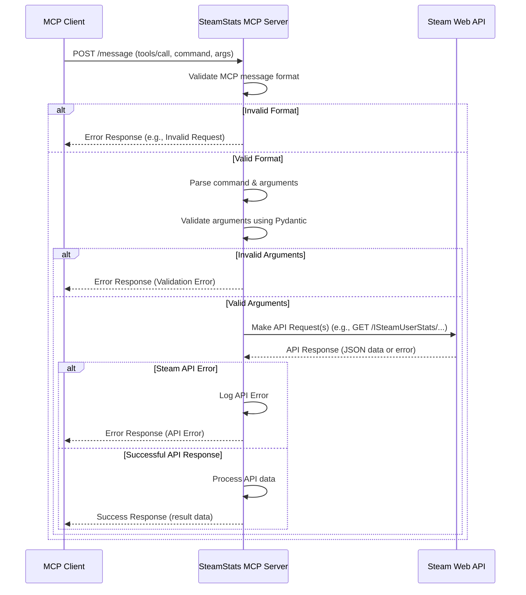

# SteamStats MCP Server

## Warning

Current implementation is not operational!

## Overview

This project implements a SteamStats MCP (Model Context Protocol) Server using Python and FastAPI. The server acts as an intermediary between an MCP client (like Roo) and the Steam Web API, providing structured access to various Steam game statistics and user information.

It exposes a single `/message` endpoint that accepts JSON-RPC style `tools/call` requests, validates them, interacts with the Steam Web API, and returns formatted results or appropriate error messages.

## Technology Stack

*   **Language:** Python 3.11+
*   **Framework:** FastAPI
*   **Data Validation:** Pydantic
*   **Web Server:** Uvicorn
*   **HTTP Client:** Requests
*   **Package Management:** UV

## Request Flow

The following diagram illustrates the typical request flow:



## Setup and Installation

1.  **Prerequisites:**
    *   Python 3.11 or higher.
    *   [UV](https://github.com/astral-sh/uv) package manager installed (`pip install uv`).

2.  **Clone the repository (if you haven't already):**
    ```bash
    git clone <repository-url>
    cd steamstats_mcp
    ```

3.  **Create a virtual environment (recommended):**
    ```bash
    # Using uv
    uv venv
    source .venv/bin/activate # On Linux/macOS
    # .venv\Scripts\activate # On Windows

    # Or using standard venv
    # python -m venv .venv
    # source .venv/bin/activate # On Linux/macOS
    # .venv\Scripts\activate # On Windows
    ```

4.  **Install dependencies:**
    ```bash
    uv pip install -r requirements.txt # Assuming a requirements.txt exists or will be generated from pyproject.toml
    # Or directly from pyproject.toml if using uv for management
    # uv sync
    ```
    *(Note: You might need to generate `requirements.txt` from `pyproject.toml` using `uv pip freeze > requirements.txt` if direct `uv sync` isn't used)*

5.  **Configure Environment Variables:** See the section below.

## Configuration (Environment Variables)

The server requires the following environment variables to be set:

*   **`STEAM_API_KEY` (Required):** Your Steam Web API key. Obtain one from the [Steam Developer website](https://steamcommunity.com/dev/apikey). The server will not function without this key.
*   **`LOG_LEVEL` (Optional):** Sets the logging level. Options include `DEBUG`, `INFO`, `WARNING`, `ERROR`, `CRITICAL`. Defaults to `INFO`.
*   **`HOST` (Optional):** The host address for the server to bind to. Defaults to `0.0.0.0` (listens on all available network interfaces).
*   **`PORT` (Optional):** The port for the server to listen on. Defaults to `8000`.

You can set these variables in your shell environment, using a `.env` file (requires `python-dotenv` package and code modification to load it), or through your deployment system's configuration.

**Example (Linux/macOS):**
```bash
export STEAM_API_KEY="YOUR_API_KEY_HERE"
export LOG_LEVEL="DEBUG"
export PORT="8080"
```

**Example (Windows CMD):**
```cmd
set STEAM_API_KEY=YOUR_API_KEY_HERE
set LOG_LEVEL=DEBUG
set PORT=8080
```

**Example (Windows PowerShell):**
```powershell
$env:STEAM_API_KEY = "YOUR_API_KEY_HERE"
$env:LOG_LEVEL = "DEBUG"
$env:PORT = "8080"
```

## Running the Server

Once dependencies are installed and environment variables are configured, run the server using Uvicorn:

```bash
uvicorn main:app --host $HOST --port $PORT --reload
```

*   Replace `main:app` if your FastAPI application instance is named differently or located in a different file.
*   The `--reload` flag enables auto-reloading during development (remove for production).
*   Uvicorn will use the `HOST` and `PORT` environment variables if set, or their defaults (`0.0.0.0` and `8000`).

The server should now be running and listening for MCP requests on `http://<HOST>:<PORT>/message`.

## Available MCP Commands

Refer to `STEAMSTATS_MCP_SPECIFICATION.md` for detailed information on available commands, their arguments, and expected results. Currently implemented commands include:

*   `getCurrentPlayers`
*   `getAppDetails`
*   `getGameSchema`
*   `getGameNews`
*   `getPlayerAchievements`
*   `getUserStatsForGame`
*   `getGlobalStatsForGame`
*   `getSupportedApiList`
*   `getAppList`
*   `getGlobalAchievementPercentages`

## Connecting a Local MCP Client (e.g., Roo)

To connect a local MCP client, such as the Roo VS Code extension, to this running server, you need to configure the client's `mcp.json` file. This file typically resides in a `.roo` directory within your project or user settings.

The configuration tells the client how to communicate with the server. Since this is an HTTP-based server (FastAPI/Uvicorn), you'll use the `sse` (Server-Sent Events) type.

1.  **Ensure the SteamStats MCP Server is running:** Follow the "Running the Server" instructions above. By default, it runs on `http://localhost:8000`.
2.  **Locate or create your `mcp.json` file:** This might be in `.roo/mcp.json` in your workspace or a global configuration location.
3.  **Add the server configuration:** Add an entry to the `servers` array in `mcp.json`.

**Example `mcp.json` entry:**

```json
{
  "servers": [
    // ... other server configurations ...
    {
      "name": "steamstats-local", // Choose a descriptive name
      "type": "sse",
      "enabled": true,
      "url": "http://localhost:8000/message", // Adjust host/port if you changed defaults
      "readTimeoutSeconds": 60,
      "writeTimeoutSeconds": 60
    }
  ]
}
```

*   **`name`**: A unique identifier for this server connection.
*   **`type`**: Must be `sse` for HTTP-based servers.
*   **`enabled`**: Set to `true` to activate the connection.
*   **`url`**: The full URL to the `/message` endpoint of the running server. Make sure the host and port match how you are running the server (e.g., if you used `export PORT=8081`, change the URL accordingly).
*   **`readTimeoutSeconds` / `writeTimeoutSeconds`**: Optional timeouts.

Once configured and the server is running, your MCP client should be able to connect and utilize the tools provided by this SteamStats server.
