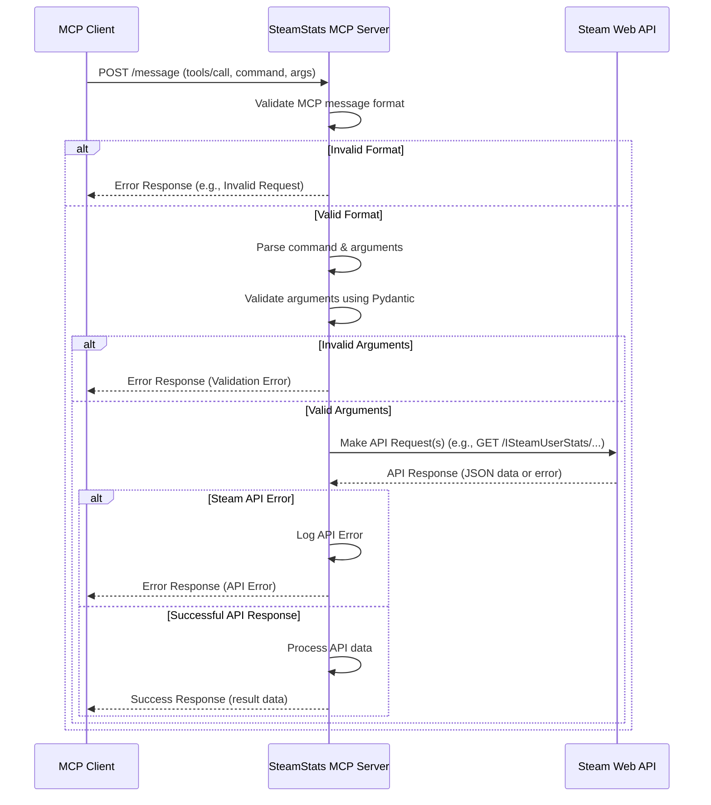

# SteamStats MCP Server Specification

## 1. Introduction

### 1.1 Purpose
This document specifies the design and functionality of the SteamStats MCP (Model Context Protocol) Server. The server acts as an intermediary between an MCP client (like Roo) and the Steam Web API, providing structured access to various Steam game statistics and information.

### 1.2 Scope
This specification covers:
*   Server architecture and technology stack.
*   MCP interaction protocol and message formats.
*   Detailed definitions of supported MCP commands (tools).
*   Robustness features including error handling, logging, input validation, and configuration.

## 2. Architecture

### 2.1 Technology Stack
*   **Language:** Python 3.11+
*   **Framework:** FastAPI
*   **Data Validation:** Pydantic
*   **Web Server:** Uvicorn
*   **HTTP Client:** Requests
*   **Package Management:** UV

### 2.2 Request Flow
The server exposes a single HTTP endpoint (`/message`) that accepts POST requests conforming to the MCP JSON-RPC style. Incoming requests trigger corresponding Steam Web API calls, and the results are formatted and returned to the client.



## 3. MCP Interaction

### 3.1 Endpoint
*   **URL:** `/message`
*   **Method:** `POST`
*   **Content-Type:** `application/json`

### 3.2 Request Format (`tools/call`)
The server primarily handles `tools/call` messages.

```json
{
  "jsonrpc": "2.0",
  "id": 123, // Request ID (integer or string)
  "method": "tools/call",
  "params": {
    "name": "command_name", // e.g., "getCurrentPlayers"
    "arguments": {
      // Command-specific arguments
      "param1": "value1",
      "param2": 123
    }
  }
}
```

### 3.3 Success Response Format
```json
{
  "jsonrpc": "2.0",
  "id": 123, // Matches request ID
  "result": {
    // Command-specific result data
  }
}
```

### 3.4 Error Response Format
See Section 5.1 Error Handling.

## 4. MCP Commands (Tools)

This section details the available commands (tools) provided by the server. Arguments and Results are defined using JSON Schema notation (as generated from Pydantic models).

---

### 4.1 `getCurrentPlayers`

*   **Description:** Retrieves the current number of players for a given Steam application ID (AppID).
*   **Arguments Schema:**
    ```json
    {
      "type": "object",
      "properties": {
        "appid": {
          "title": "Appid",
          "type": "integer",
          "description": "The Steam Application ID of the game."
        }
      },
      "required": ["appid"]
    }
    ```
*   **Result Schema:** (Based on `ISteamUserStats/GetNumberOfCurrentPlayers/v1`)
    ```json
    {
      "type": "object",
      "properties": {
        "response": {
          "type": "object",
          "properties": {
            "player_count": {
              "title": "Player Count",
              "type": "integer",
              "description": "Current number of players online."
            },
            "result": {
              "title": "Result Code",
              "type": "integer",
              "description": "Steam API result code (1 for success)."
            }
          },
          "required": ["player_count", "result"]
        }
      },
      "required": ["response"]
    }
    ```
*   **Potential Errors:** `Invalid AppID`, `Steam API Error`, `Network Error`.

---

### 4.2 `getAppDetails`

*   **Description:** Retrieves store page details for one or more Steam AppIDs. Note: This often requires multiple API calls per AppID.
*   **Arguments Schema:**
    ```json
    {
      "type": "object",
      "properties": {
        "appids": {
          "title": "Appids",
          "type": "array",
          "items": {
            "type": "integer"
          },
          "description": "A list of Steam Application IDs."
        },
        "country": {
            "title": "Country Code",
            "type": "string",
            "description": "ISO 3166 country code for regional pricing/filtering (e.g., 'US', 'GB'). Optional.",
            "default": null
        }
      },
      "required": ["appids"]
    }
    ```
*   **Result Schema:** (Simplified structure based on `appdetails` endpoint)
    ```json
    {
      "type": "object",
      "description": "A dictionary where keys are AppIDs (as strings) and values are app detail objects or error indicators.",
      "additionalProperties": {
        "type": "object",
        "properties": {
          "success": { "type": "boolean" },
          "data": {
            "type": "object",
            "properties": {
              "name": { "type": "string" },
              "steam_appid": { "type": "integer" },
              "short_description": { "type": "string" },
              "header_image": { "type": "string", "format": "uri" },
              "developers": { "type": "array", "items": { "type": "string" } },
              "publishers": { "type": "array", "items": { "type": "string" } },
              "price_overview": {
                  "type": "object",
                  "properties": {
                      "currency": {"type": "string"},
                      "initial": {"type": "integer", "description": "Price in cents"},
                      "final": {"type": "integer", "description": "Price in cents after discount"},
                      "discount_percent": {"type": "integer"}
                  }
              },
              "genres": {
                  "type": "array",
                  "items": {
                      "type": "object",
                      "properties": {
                          "id": {"type": "string"},
                          "description": {"type": "string"}
                      }
                  }
              },
              "release_date": {
                  "type": "object",
                  "properties": {
                      "coming_soon": {"type": "boolean"},
                      "date": {"type": "string", "description": "e.g., '1 Jan, 2024'"}
                  }
              }
              // Add more fields as needed (e.g., platforms, metacritic)
            }
          },
          "error": { "type": "string", "description": "Error message if success is false for this appid." }
        }
      }
    }
    ```
*   **Potential Errors:** `Invalid AppID`, `Steam API Error`, `Network Error`, `Partial Failure` (if some AppIDs succeed and others fail).

---

### 4.3 `getGameSchema`

*   **Description:** Retrieves the game schema (stats and achievements definitions) for a given AppID.
*   **Arguments Schema:**
    ```json
    {
      "type": "object",
      "properties": {
        "appid": {
          "title": "Appid",
          "type": "integer",
          "description": "The Steam Application ID of the game."
        }
      },
      "required": ["appid"]
    }
    ```
*   **Result Schema:** (Based on `ISteamUserStats/GetSchemaForGame/v2`)
    ```json
    {
      "type": "object",
      "properties": {
        "game": {
          "type": "object",
          "properties": {
            "gameName": { "type": "string" },
            "gameVersion": { "type": "string" },
            "availableGameStats": {
              "type": "object",
              "properties": {
                "stats": {
                  "type": "array",
                  "items": {
                    "type": "object",
                    "properties": {
                      "name": { "type": "string" },
                      "defaultvalue": { "type": "number" },
                      "displayName": { "type": "string" }
                    }
                  }
                },
                "achievements": {
                  "type": "array",
                  "items": {
                    "type": "object",
                    "properties": {
                      "name": { "type": "string" },
                      "defaultvalue": { "type": "integer" },
                      "displayName": { "type": "string" },
                      "hidden": { "type": "integer" }, // 0 or 1
                      "description": { "type": "string" },
                      "icon": { "type": "string", "format": "uri" },
                      "icongray": { "type": "string", "format": "uri" }
                    }
                  }
                }
              }
            }
          }
        }
      },
      "required": ["game"]
    }
    ```
*   **Potential Errors:** `Invalid AppID`, `Schema Not Found`, `Steam API Error`, `Network Error`.

---

### 4.4 `getGameNews`

*   **Description:** Retrieves the latest news items for a given AppID.
*   **Arguments Schema:**
    ```json
    {
      "type": "object",
      "properties": {
        "appid": {
          "title": "Appid",
          "type": "integer",
          "description": "The Steam Application ID of the game."
        },
        "count": {
          "title": "Count",
          "type": "integer",
          "description": "Number of news items to retrieve.",
          "default": 10
        },
        "maxlength": {
          "title": "Max Length",
          "type": "integer",
          "description": "Maximum length of the 'contents' field for each news item. 0 for full content.",
          "default": 300
        }
      },
      "required": ["appid"]
    }
    ```
*   **Result Schema:** (Based on `ISteamNews/GetNewsForApp/v2`)
    ```json
    {
      "type": "object",
      "properties": {
        "appnews": {
          "type": "object",
          "properties": {
            "appid": { "type": "integer" },
            "newsitems": {
              "type": "array",
              "items": {
                "type": "object",
                "properties": {
                  "gid": { "type": "string" },
                  "title": { "type": "string" },
                  "url": { "type": "string", "format": "uri" },
                  "is_external_url": { "type": "boolean" },
                  "author": { "type": "string" },
                  "contents": { "type": "string", "description": "News content (potentially truncated)." },
                  "feedlabel": { "type": "string" },
                  "date": { "type": "integer", "format": "timestamp", "description": "Unix timestamp." },
                  "feedname": { "type": "string" }
                }
              }
            },
            "count": { "type": "integer", "description": "Number of items returned." }
          }
        }
      },
      "required": ["appnews"]
    }
    ```
*   **Potential Errors:** `Invalid AppID`, `Steam API Error`, `Network Error`.

---

### 4.5 `getPlayerAchievements`

*   **Description:** Retrieves a player's achievement status for a specific game. Requires the player's 64-bit SteamID. Profile visibility settings may affect results.
*   **Arguments Schema:**
    ```json
    {
      "type": "object",
      "properties": {
        "steamid": {
          "title": "Steamid",
          "type": "string",
          "description": "The player's 64-bit Steam ID."
        },
        "appid": {
          "title": "Appid",
          "type": "integer",
          "description": "The Steam Application ID of the game."
        }
      },
      "required": ["steamid", "appid"]
    }
    ```
*   **Result Schema:** (Based on `ISteamUserStats/GetPlayerAchievements/v1`)
    ```json
    {
      "type": "object",
      "properties": {
        "playerstats": {
          "type": "object",
          "properties": {
            "steamID": { "type": "string" },
            "gameName": { "type": "string" },
            "achievements": {
              "type": "array",
              "items": {
                "type": "object",
                "properties": {
                  "apiname": { "type": "string" },
                  "achieved": { "type": "integer", "description": "1 if achieved, 0 otherwise." },
                  "unlocktime": { "type": "integer", "format": "timestamp", "description": "Unix timestamp when achieved, 0 if not." }
                  // Note: Does not include display name/description here, requires merging with getGameSchema
                }
              }
            },
            "success": { "type": "boolean" },
            "error": { "type": "string", "description": "Error message if success is false (e.g., 'Profile is private')." }
          }
        }
      },
      "required": ["playerstats"]
    }
    ```
*   **Potential Errors:** `Invalid AppID`, `Invalid SteamID`, `Profile Private`, `Steam API Error`, `Network Error`.

---

### 4.6 `getUserStatsForGame`

*   **Description:** Retrieves detailed statistics for a user in a specific game. Requires the player's 64-bit SteamID. Profile visibility settings may affect results.
*   **Arguments Schema:**
    ```json
    {
      "type": "object",
      "properties": {
        "steamid": {
          "title": "Steamid",
          "type": "string",
          "description": "The player's 64-bit Steam ID."
        },
        "appid": {
          "title": "Appid",
          "type": "integer",
          "description": "The Steam Application ID of the game."
        }
      },
      "required": ["steamid", "appid"]
    }
    ```
*   **Result Schema:** (Based on `ISteamUserStats/GetUserStatsForGame/v1`)
    ```json
    {
      "type": "object",
      "properties": {
        "playerstats": {
          "type": "object",
          "properties": {
            "steamID": { "type": "string" },
            "gameName": { "type": "string" },
            "stats": {
              "type": "array",
              "items": {
                "type": "object",
                "properties": {
                  "name": { "type": "string", "description": "API name of the stat." },
                  "value": { "type": "number", "description": "Value of the stat." }
                },
                 "required": ["name", "value"]
              }
            },
            "achievements": {
               "type": "array",
               "description": "Note: This endpoint might also return achievements similar to getPlayerAchievements. Including for completeness, but primary focus is stats.",
               "items": {
                 "type": "object",
                 "properties": {
                   "name": { "type": "string", "description": "API name of the achievement." },
                   "achieved": { "type": "integer", "description": "1 if achieved, 0 otherwise." }
                 },
                 "required": ["name", "achieved"]
               }
            },
            "success": { "type": "boolean", "description": "Indicates if the request for this specific user/game was successful." },
            "error": { "type": "string", "description": "Error message if success is false (e.g., 'Profile is private')." }
          },
           "required": ["steamID", "gameName", "success"] // Stats/Achievements might be empty
        }
      },
      "required": ["playerstats"]
    }
    ```
*   **Potential Errors:** `Invalid AppID`, `Invalid SteamID`, `Profile Private`, `Stats Not Found`, `Steam API Error`, `Network Error`.

---

### 4.8 `getSupportedApiList`

*   **Description:** Retrieves the complete list of supported Steam Web API interfaces and their methods. Useful for discovery.
*   **Arguments Schema:**
    ```json
    {
      "type": "object",
      "properties": {},
      "description": "No arguments required for this command."
    }
    ```
*   **Result Schema:** (Based on `ISteamWebAPIUtil/GetSupportedAPIList/v1`)
    ```json
    {
      "type": "object",
      "properties": {
        "apilist": {
          "type": "object",
          "properties": {
            "interfaces": {
              "type": "array",
              "items": {
                "type": "object",
                "properties": {
                  "name": { "type": "string", "description": "Interface name (e.g., 'ISteamUserStats')." },
                  "methods": {
                    "type": "array",
                    "items": {
                      "type": "object",
                      "properties": {
                        "name": { "type": "string", "description": "Method name (e.g., 'GetUserStatsForGame')." },
                        "version": { "type": "integer", "description": "Method version." },
                        "httpmethod": { "type": "string", "description": "HTTP method (e.g., 'GET')." },
                        "parameters": {
                          "type": "array",
                          "items": {
                            "type": "object",
                            "properties": {
                              "name": { "type": "string", "description": "Parameter name." },
                              "type": { "type": "string", "description": "Parameter data type (e.g., 'uint64', 'string')." },
                              "optional": { "type": "boolean", "description": "Whether the parameter is optional." },
                              "description": { "type": "string", "description": "Parameter description." }
                            },
                            "required": ["name", "type", "optional"]
                          }
                        }
                      },
                      "required": ["name", "version", "httpmethod", "parameters"]
                    }
                  }
                },
                "required": ["name", "methods"]
              }
            }
          },
          "required": ["interfaces"]
        }
      },
      "required": ["apilist"]
    }
    ```
*   **Potential Errors:** `Steam API Error`, `Network Error`.

---

### 4.9 `getAppList`

*   **Description:** Retrieves the complete list of public applications (games, software, etc.) available on Steam.
*   **Arguments Schema:**
    ```json
    {
      "type": "object",
      "properties": {},
      "description": "No arguments required for this command."
    }
    ```
*   **Result Schema:** (Based on `ISteamApps/GetAppList/v2`)
    ```json
    {
      "type": "object",
      "properties": {
        "applist": {
          "type": "object",
          "properties": {
            "apps": {
              "type": "array",
              "items": {
                "type": "object",
                "properties": {
                  "appid": { "type": "integer", "description": "The application ID." },
                  "name": { "type": "string", "description": "The name of the application." }
                },
                "required": ["appid", "name"]
              }
            }
          },
          "required": ["apps"]
        }
      },
      "required": ["applist"]
    }
    ```
*   **Potential Errors:** `Steam API Error`, `Network Error`.

---

### 4.10 `getGlobalAchievementPercentages`

*   **Description:** Retrieves the global achievement completion percentages for a specific game.
*   **Arguments Schema:**
    ```json
    {
      "type": "object",
      "properties": {
        "appid": {
          "title": "Appid",
          "type": "integer",
          "description": "The Steam Application ID of the game. Note: The underlying Steam API uses 'gameid', but we use 'appid' for consistency."
        }
      },
      "required": ["appid"]
    }
    ```
*   **Result Schema:** (Based on `ISteamUserStats/GetGlobalAchievementPercentagesForApp/v2`)
    ```json
    {
      "type": "object",
      "properties": {
        "achievementpercentages": {
          "type": "object",
          "properties": {
            "achievements": {
              "type": "array",
              "items": {
                "type": "object",
                "properties": {
                  "name": { "type": "string", "description": "The API name of the achievement." },
                  "percent": { "type": "number", "format": "float", "description": "The global completion percentage for this achievement." }
                },
                "required": ["name", "percent"]
              }
            }
          },
          "required": ["achievements"]
        }
      },
      "required": ["achievementpercentages"]
    }
    ```
*   **Potential Errors:** `Invalid AppID`, `Achievements Not Found`, `Steam API Error`, `Network Error`.

---

### 4.7 `getGlobalStatsForGame`

*   **Description:** Retrieves aggregated global stats for a specific game, if supported. Global stats often represent totals or averages across all players.
*   **Arguments Schema:**
    ```json
    {
      "type": "object",
      "properties": {
        "appid": {
          "title": "Appid",
          "type": "integer",
          "description": "The Steam Application ID of the game."
        },
        "stat_names": {
            "title": "Stat Names",
            "type": "array",
            "items": { "type": "string" },
            "description": "List of specific global stat API names to retrieve."
        },
        "start_date": {
            "title": "Start Date",
            "type": "integer",
            "format": "timestamp",
            "description": "Optional Unix timestamp for the start date of the stats reporting period.",
            "default": null
        },
        "end_date": {
            "title": "End Date",
            "type": "integer",
            "format": "timestamp",
            "description": "Optional Unix timestamp for the end date of the stats reporting period.",
            "default": null
        }
      },
      "required": ["appid", "stat_names"]
    }
    ```
*   **Result Schema:** (Based on `ISteamUserStats/GetGlobalStatsForGame/v1`)
    ```json
    {
      "type": "object",
      "properties": {
        "response": {
          "type": "object",
          "properties": {
            "result": {
              "title": "Result Code",
              "type": "integer",
              "description": "Steam API result code (1 for success)."
            },
            "globalstats": {
              "title": "Global Stats",
              "type": "object",
              "description": "An object where keys are the requested stat names and values are objects containing the stat value.",
              "additionalProperties": {
                "type": "object",
                "properties": {
                  "total": {
                    "title": "Total Value",
                    "type": "string",  // Steam often returns large numbers as strings
                    "description": "The aggregated value for this global stat."
                  }
                },
                "required": ["total"]
              }
            },
            "error": { "type": "string", "description": "Error message if result code indicates failure." }
          },
          "required": ["result"] // globalstats might be empty or absent on failure/no data
        }
      },
      "required": ["response"]
    }
    ```
*   **Potential Errors:** `Invalid AppID`, `Stats Not Found`, `Invalid Date Range`, `Steam API Error`, `Network Error`.

---

## 5. Robustness

### 5.1 Error Handling

Errors are reported using the standard JSON-RPC 2.0 error object format within the response.

**Error Response Format:**
```json
{
  "jsonrpc": "2.0",
  "id": 123, // Matches request ID, or null if request ID couldn't be determined
  "error": {
    "code": -32000, // Example code
    "message": "Descriptive error message",
    "data": {
      // Optional: Additional error details
      "type": "Steam API Error", // Category
      "details": "Specific details, e.g., API status code or validation failure info"
    }
  }
}
```

**Error Codes & Categories:**
*   **-32700 Parse Error:** Invalid JSON received.
*   **-32600 Invalid Request:** JSON is not a valid Request object.
*   **-32601 Method Not Found:** The method (`tools/call`) or command (`params.name`) does not exist.
*   **-32602 Invalid Params:** Invalid method parameters (e.g., missing required args, wrong types). Pydantic validation errors fall here.
    *   `data.type`: "Validation Error"
    *   `data.details`: Pydantic validation error details.
*   **-32603 Internal Error:** Internal server error during processing.
    *   `data.type`: "Internal Server Error"
*   **-32000 to -32099 Server Errors:** Custom server errors.
    *   **-32001 Steam API Error:** Error communicating with or processing response from the Steam API.
        *   `data.type`: "Steam API Error"
        *   `data.details`: e.g., "API returned status 403", "Invalid AppID", "Profile Private", "Schema Not Found".
    *   **-32002 Network Error:** Network issues preventing communication with Steam API (e.g., timeout, connection refused).
        *   `data.type`: "Network Error"
        *   `data.details`: Underlying exception message.
    *   **-32003 Configuration Error:** Server configuration issue (e.g., missing API key).
        *   `data.type`: "Configuration Error"

Steam API errors (non-200 status codes, specific error messages in responses) will be mapped to the `-32001` code with appropriate messages and details. Network exceptions from `requests` will be mapped to `-32002`.

### 5.2 Logging

*   **Format:** Structured JSON logging per request/response cycle.
*   **Levels:** DEBUG, INFO, WARNING, ERROR, CRITICAL (standard Python logging levels). Log level configurable via environment variable (e.g., `LOG_LEVEL`, default `INFO`).
*   **Logged Information (per request):**
    *   `timestamp`: ISO 8601 format.
    *   `level`: Log level name (e.g., "INFO").
    *   `message`: Summary message (e.g., "Processing request", "Request successful", "Request failed").
    *   `request_id`: Unique ID associated with the incoming MCP request (`message.id`).
    *   `command`: MCP command name (`params.name`).
    *   `arguments`: Incoming arguments (potentially sanitized/truncated for sensitive data or size). (INFO level)
    *   `status_code`: HTTP status code returned (e.g., 200, 400, 500). (INFO level)
    *   `duration_ms`: Request processing time in milliseconds. (INFO level)
    *   `steam_api_calls`: List of Steam API endpoints called during the request. (DEBUG level)
    *   `error_code`: JSON-RPC error code if request failed. (ERROR level)
    *   `error_message`: JSON-RPC error message if request failed. (ERROR level)
    *   `error_details`: Additional error data if request failed. (ERROR level)
    *   `exception_info`: Full traceback for unhandled exceptions. (ERROR level)

### 5.3 Input Validation

*   Pydantic models are used to define and validate the `arguments` for each command.
*   If validation fails, the server immediately returns a JSON-RPC error response with code `-32602` (Invalid Params).
*   The `error.data.details` field will contain structured information about the validation failures provided by Pydantic.

### 5.4 Configuration

*   **`STEAM_API_KEY` (Required):** The Steam Web API key. Must be provided as an environment variable. The server will fail to start or return a configuration error if missing.
*   **`LOG_LEVEL` (Optional):** Logging level (e.g., `DEBUG`, `INFO`, `WARNING`). Defaults to `INFO`. Provided as an environment variable.
*   **`HOST` (Optional):** Host address for Uvicorn to bind to. Defaults to `0.0.0.0`. Provided as an environment variable.
*   **`PORT` (Optional):** Port for Uvicorn to listen on. Defaults to `8000`. Provided as an environment variable.

### 5.5 Steam API Interaction

*   **Base URL:** Primarily uses `https://api.steampowered.com`. Specific interfaces (e.g., `ISteamUserStats`, `ISteamNews`, `IStoreService`) will be appended.
*   **API Key:** The `STEAM_API_KEY` is required for most calls and should be appended as a `key` query parameter.
*   **Rate Limiting:** The Steam Web API has rate limits (often per-IP, potentially per-key). The server should:
    *   Log warnings if rate-limit-related errors (e.g., HTTP 429) are received from the API.
    *   *Future Enhancement:* Consider implementing basic retry logic with exponential backoff for transient errors like rate limits, if they become problematic. This specification does not mandate implementation initially.
*   **Timeouts:** Use reasonable timeouts for `requests` calls (e.g., 10 seconds connect, 30 seconds read) to prevent indefinite hangs.